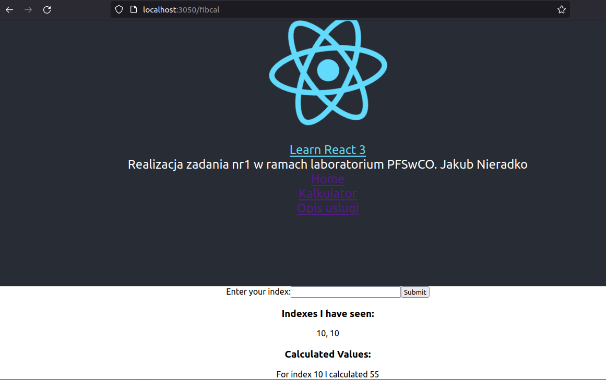

# Laboratorium PFSwCh0 Zadanie 1

## Uruchomienie

W głównym katalogu należy otworzyć terminal, a następnie użyć polecenia:  
`docker compose up`   Po uruchominiu w przeglądarce wpisać: http://localhost:3050

## Architektura

Aplikacja została wykonana na podstawie projektu z lab9.
Zmienione zostały pliki:

- app.js - dodano linki do stron oraz routing
- otherpage.js - dodano informacje o wprowadzonych zmianach
- fib.js - zmieniono algorytm obliczający k-ty element ciagu fibonacciego

## Funkcjonalności

Po uruchomieniu na stronie głównej są trzy strony:

- home - tytuł oraz dane autora,
- kalkulator - kalkulator pozwalający na policzenie k-tego wyrazu ciągu fibonacciego,
- opis uslugi - opis co zostało dodane/zmienione.

## Działanie aplikacji

